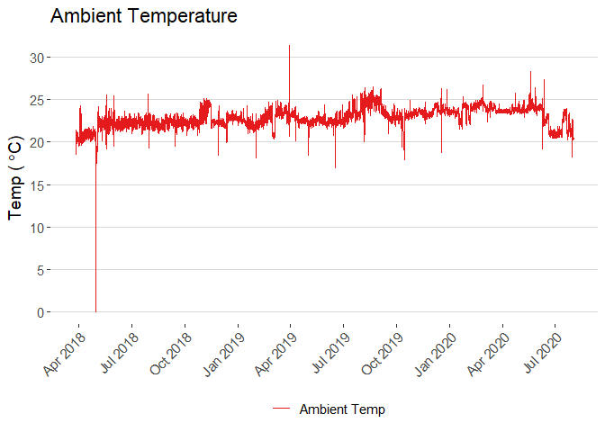

<!-- README.md is generated from README.Rmd. Please edit that file -->

# Thermo\_readbacks

<!-- badges: start -->

<!-- badges: end -->

A soon-to-be R package supporting Thermo mass spectrometry instrument
readback analysis. Thermo orbitrap mass spectrometers record numerous
instrument readbacks including:

  - Ambient temperature
  - Analyzer temperature
  - CEPS Peltier temperature
  - Fore vacuum pressure
  - high vacuum pressure
  - ultra high vacuum pressure

### Supported Instruments

  - Q-Exactive family instruments
  - Exploris family instruments

### Path to log files

#### Q Exactive

`C:\Xcalibur\system\Exactive\log\`

#### Exploris

`C:\ProgramData\Thermo\Exploris\Log`

# Importing log files

<!-- -->
