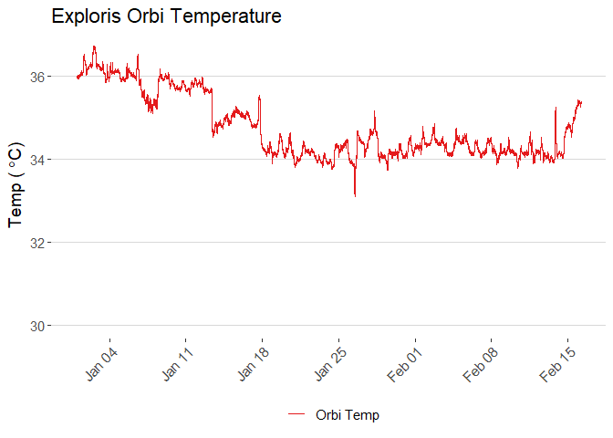

<!-- README.md is generated from README.Rmd. Please edit that file -->

# Thermo\_readbacks

<!-- badges: start -->

<!-- badges: end -->

A soon-to-be R package supporting Thermo mass spectrometry instrument
readback analysis. Thermo orbitrap mass spectrometers record numerous
instrument readbacks including:

  - Ambient temperature
  - Analyzer temperature
  - CEPS Peltier temperature
  - Fore vacuum pressure
  - high vacuum pressure
  - ultra high vacuum pressure

### Supported Instruments

  - Q-Exactive family instruments
  - Exploris family instruments

### Path to log files

#### Q Exactive

`C:\Xcalibur\system\Exactive\log\`

#### Exploris

`C:\ProgramData\Thermo\Exploris\Log`

# Importing log files

``` r


ggplot(data %>% filter(time <= as.Date("2020-12-08")),
       aes(x = time)) +
  geom_line(aes(y = ambient_temperature_raw_c, color = "Ambient Temp")) +
  # geom_line(aes(y = analyzer_temperature_sensor_c, color = "Analyzer Temp sensor")) +
  # geom_line(aes(y = ceps_peltier_temperature_sensor_c, color = "CEPS Peltier temp sensor")) +
  scale_color_brewer(palette = "Set1") +
  # expand_limits(y = c(25,30)) +
  labs(title = "Ambient Temperature",
       y = expression('Temp ('~degree*C*')'),
       x = NULL,
       color = NULL) +
  scale_x_datetime(breaks = scales::breaks_pretty(10)) +
  scale_y_continuous(limits = c(0,NA),
                     breaks = breaks_pretty()) +
  theme(axis.text.x = element_text(angle = 45, hjust = 1)) +
  # guides(color = FALSE) +
  ggthemes::theme_hc(base_size = 14) 
```

<!-- -->
